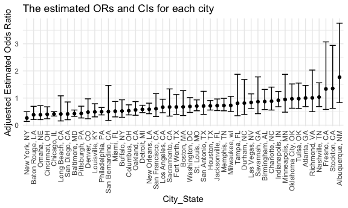

p8105_hw6_cw3555
================
Eunice Wang
`2023-12-02`

Load key packages.

``` r
library(tidyverse)
library(modelr)
library(p8105.datasets)

set.seed(1)
```

### Problem 1

#### Load and clean the raw data.

``` r
homicide_df=
  read_csv("data/homicide-data.csv") |> 
  janitor::clean_names() |> 
  mutate(
    city_state=str_c(city,state,sep =", "),
    resolved = as.numeric(disposition == "Closed by arrest"), 
    victim_age=as.numeric(victim_age)
    )|> 
      filter(!city_state %in% c("Dallas, TX","Phoenix, AZ", "Kansas City, MO", "Tulsa, AL" )) |> 
      filter(victim_race %in% c("Black", "White")) |> 
  select(city_state,resolved, victim_age, victim_sex, victim_race)
```

    ## Rows: 52179 Columns: 12
    ## ── Column specification ────────────────────────────────────────────────────────
    ## Delimiter: ","
    ## chr (9): uid, victim_last, victim_first, victim_race, victim_age, victim_sex...
    ## dbl (3): reported_date, lat, lon
    ## 
    ## ℹ Use `spec()` to retrieve the full column specification for this data.
    ## ℹ Specify the column types or set `show_col_types = FALSE` to quiet this message.

#### Fit a logistic regression for Baltimore, MD and save the results for estimates

``` r
fit_baltimore=
  homicide_df |> 
  filter(city_state=="Baltimore, MD") |> 
  glm(
    resolved ~ victim_age + victim_sex + victim_race, 
    data = _, 
    family = binomial())

baltimore_results=
fit_baltimore |> 
  broom::tidy() |> 
  mutate(
    OR = exp(estimate),
    OR_CI_lower = exp(estimate-1.96*std.error),
    OR_CI_upper = exp(estimate+1.96*std.error)
    ) |> 
  filter(term=="victim_sexMale") |> 
  select(OR,OR_CI_lower,OR_CI_upper) 
```

The estimated proportion of unsolve homicides in Baltimore, MD is
0.4255117and the CI is \[0.324559, 0.5578655\]

#### Fit a logistic regression for each of the cities and save the results for estimates

``` r
city_glm_model=
  homicide_df |> 
  nest(df = -city_state) |> 
  mutate(
    models = map(df, \(df) glm(resolved ~ victim_age + victim_sex +victim_race, family = binomial(), data = df)),
    results = map(models, broom::tidy)
  ) |>
  select(city_state, results) |> 
  unnest(results) |> 
  mutate(
    OR = exp(estimate),
    OR_CI_lower = exp(estimate-1.96*std.error),
    OR_CI_upper = exp(estimate+1.96*std.error)
    ) |> 
    filter(term=="victim_sexMale") |> 
    select(city_state,OR,OR_CI_lower,OR_CI_upper) 

city_glm_model |> 
  head() |> 
  knitr::kable(digits = 2) 
```

| city_state      |   OR | OR_CI_lower | OR_CI_upper |
|:----------------|-----:|------------:|------------:|
| Albuquerque, NM | 1.77 |        0.83 |        3.76 |
| Atlanta, GA     | 1.00 |        0.68 |        1.46 |
| Baltimore, MD   | 0.43 |        0.32 |        0.56 |
| Baton Rouge, LA | 0.38 |        0.21 |        0.70 |
| Birmingham, AL  | 0.87 |        0.57 |        1.32 |
| Boston, MA      | 0.67 |        0.36 |        1.28 |

#### Create a plot that shows the estimates for each city and comment

``` r
city_glm_model |>  
  ggplot(aes(x=fct_reorder(city_state, OR), y=OR, ymin=OR_CI_lower, ymax=OR_CI_upper))+
  geom_point()+
  geom_errorbar()+
  theme(axis.text.x=element_text(angle=90, vjust=0.5,hjust=1))+
  labs(
    x="City_State",
    y="Adjuested Estimated Odds Ratio" ,
    title="The estimated ORs and CIs for each city"
  )
```



The plots shows the estimated ORs and CIs for each city. The estimated
odds ratio is ordered from the smallest estimated OR to the largest one.
In most cities, the estimated odds ratio is less than 1. CIs in most
cities are narrow and do not contain 1, which implies a significant
difference in resolved rates between both sexes after adjustment.
