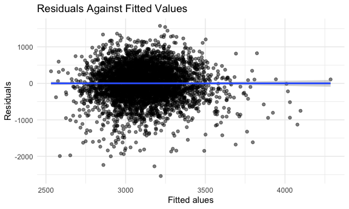
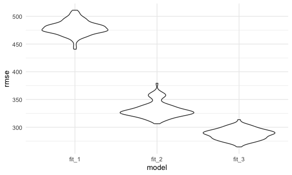

p8105_hw6_cw3555
================
Eunice Wang
`2023-12-02`

Load key packages.

``` r
library(tidyverse)
library(modelr)
library(p8105.datasets)

set.seed(1)
```

### Problem 1

#### Load and clean the raw data.

``` r
homicide_df=
  read_csv("data/homicide-data.csv") |> 
  janitor::clean_names() |> 
  mutate(
    city_state=str_c(city,state,sep =", "),
    resolved = as.numeric(disposition == "Closed by arrest"), 
    victim_age=as.numeric(victim_age)
    )|> 
      filter(!city_state %in% c("Dallas, TX","Phoenix, AZ", "Kansas City, MO", "Tulsa, AL" )) |> 
      filter(victim_race %in% c("Black", "White")) |> 
  select(city_state,resolved, victim_age, victim_sex, victim_race)
```

    ## Rows: 52179 Columns: 12
    ## ── Column specification ────────────────────────────────────────────────────────
    ## Delimiter: ","
    ## chr (9): uid, victim_last, victim_first, victim_race, victim_age, victim_sex...
    ## dbl (3): reported_date, lat, lon
    ## 
    ## ℹ Use `spec()` to retrieve the full column specification for this data.
    ## ℹ Specify the column types or set `show_col_types = FALSE` to quiet this message.

#### Fit a logistic regression for Baltimore, MD and save the results for estimates

``` r
fit_baltimore=
  homicide_df |> 
  filter(city_state=="Baltimore, MD") |> 
  glm(
    resolved ~ victim_age + victim_sex + victim_race, 
    data = _, 
    family = binomial())

baltimore_results=
fit_baltimore |> 
  broom::tidy() |> 
  mutate(
    OR = exp(estimate),
    OR_CI_lower = exp(estimate-1.96*std.error),
    OR_CI_upper = exp(estimate+1.96*std.error)
    ) |> 
  filter(term=="victim_sexMale") |> 
  select(OR,OR_CI_lower,OR_CI_upper) 
```

The estimated proportion of unsolve homicides in Baltimore, MD is
0.4255117and the CI is \[0.324559, 0.5578655\]

#### Fit a logistic regression for each of the cities and save the results for estimates

``` r
city_glm_model=
  homicide_df |> 
  nest(df = -city_state) |> 
  mutate(
    models = map(df, \(df) glm(resolved ~ victim_age + victim_sex +victim_race, family = binomial(), data = df)),
    results = map(models, broom::tidy)
  ) |>
  select(city_state, results) |> 
  unnest(results) |> 
  mutate(
    OR = exp(estimate),
    OR_CI_lower = exp(estimate-1.96*std.error),
    OR_CI_upper = exp(estimate+1.96*std.error)
    ) |> 
    filter(term=="victim_sexMale") |> 
    select(city_state,OR,OR_CI_lower,OR_CI_upper) 

city_glm_model |> 
  head() |> 
  knitr::kable(digits = 2) 
```

| city_state      |   OR | OR_CI_lower | OR_CI_upper |
|:----------------|-----:|------------:|------------:|
| Albuquerque, NM | 1.77 |        0.83 |        3.76 |
| Atlanta, GA     | 1.00 |        0.68 |        1.46 |
| Baltimore, MD   | 0.43 |        0.32 |        0.56 |
| Baton Rouge, LA | 0.38 |        0.21 |        0.70 |
| Birmingham, AL  | 0.87 |        0.57 |        1.32 |
| Boston, MA      | 0.67 |        0.36 |        1.28 |

#### Create a plot that shows the estimates for each city and comment

``` r
city_glm_model |>  
  ggplot(aes(x=fct_reorder(city_state, OR), y=OR, ymin=OR_CI_lower, ymax=OR_CI_upper))+
  geom_point()+
  geom_errorbar()+
  theme(axis.text.x=element_text(angle=90, vjust=0.5,hjust=1))+
  labs(
    x="City_State",
    y="Adjuested Estimated Odds Ratio" ,
    title="The estimated ORs and CIs for each city"
  )
```


The plots shows the estimated ORs and CIs for each city. The estimated
odds ratio is ordered from the smallest estimated OR to the largest one.
In most cities, the estimated odds ratio is less than 1. CIs in most
cities are narrow and do not contain 1, which implies a significant
difference in resolved rates between both sexes after adjustment.

### Problem 2

#### Load and clean the raw data.

``` r
weather_df = 
  rnoaa::meteo_pull_monitors(
    c("USW00094728"),
    var = c("PRCP", "TMIN", "TMAX"), 
    date_min = "2022-01-01",
    date_max = "2022-12-31") |>
  mutate(
    name = recode(id, USW00094728 = "CentralPark_NY"),
    tmin = tmin / 10,
    tmax = tmax / 10) |>
  select(name, id, everything())
```

    ## using cached file: /Users/mac/Library/Caches/org.R-project.R/R/rnoaa/noaa_ghcnd/USW00094728.dly

    ## date created (size, mb): 2023-10-04 16:33:34.519205 (8.527)

    ## file min/max dates: 1869-01-01 / 2023-10-31

#### Fit a linear regression

``` r
weather_lm=
  lm(tmax ~ tmin+prcp, data=weather_df)
broom::tidy(weather_lm)
```

    ## # A tibble: 3 × 5
    ##   term        estimate std.error statistic   p.value
    ##   <chr>          <dbl>     <dbl>     <dbl>     <dbl>
    ## 1 (Intercept)  8.04      0.230      35.0   4.39e-118
    ## 2 tmin         1.01      0.0162     62.7   1.43e-196
    ## 3 prcp        -0.00154   0.00210    -0.733 4.64e-  1

``` r
broom::glance(weather_lm)
```

    ## # A tibble: 1 × 12
    ##   r.squared adj.r.squared sigma statistic   p.value    df logLik   AIC   BIC
    ##       <dbl>         <dbl> <dbl>     <dbl>     <dbl> <dbl>  <dbl> <dbl> <dbl>
    ## 1     0.916         0.915  2.96     1972. 2.19e-195     2  -912. 1832. 1848.
    ## # ℹ 3 more variables: deviance <dbl>, df.residual <int>, nobs <int>

#### Bootstrap for r̂ 2

``` r
boot_results_rsq = 
  weather_df |> 
   modelr::bootstrap(n = 5000) |> 
   mutate(
    models = map(strap, \(df) lm(tmax ~ tmin+prcp, data=df)),
    results = map(models, broom::glance),
  ) |> 
  select(results) |> 
  unnest(results) 
```

Make a plot of r̂ 2

``` r
boot_results_rsq|> 
  select(r.squared) |> 
  ggplot(aes(x=r.squared))+
  geom_density()+
  labs(
    x="Bootstrap R-squared",
    y="Frequency",
    title="Distribution of Bootstrap Estimated R-squared"
  )
```


This plot for `r-squared` measure the goodness of fit regarding a model.
From the plot, we can see that most of the estimates of `r-squared`
range from 0.90 to 0.94, with a peak around 0.92. The majority of the
bootstrap samples has a value of 0.92 for its `r_squared`.This indicates
a generally good fit of the model. The distribution is slightly skewed
to the left.

Provide the 95% confidence interval for r̂ 2

``` r
CI_r_squared=
  boot_results_rsq|> 
  summarize(
    ci_lower = quantile(r.squared, 0.025),
    ci_upper = quantile(r.squared, 0.975)
  ) 
```

The CI for `r_squared` is \[0.8885495, 0.9406812\]

#### Bootstrap for log(β̂ 1∗β̂ 2

``` r
boot_results_log_beta = 
  weather_df |> 
   modelr::bootstrap(n = 5000) |> 
   mutate(
    models = map(strap, \(df) lm(tmax ~ tmin+prcp, data=df)),
    results = map(models, broom::tidy),
  ) |> 
  select(id=.id, results) |> 
  unnest(results) |> 
  select(id, term, estimate) |> 
  pivot_wider(
    names_from=term,
    values_from=estimate) |> 
  rename(beta_1=tmin, beta_2=prcp)
```

Make a plot for log(β̂ 1∗β̂ 2)

``` r
filtered_boot_results=
  boot_results_log_beta |> 
  filter(beta_1*beta_2>0) |> 
  mutate(log_beta_product=log(beta_1*beta_2))

filtered_boot_results|> 
  ggplot(aes(x=pull(filtered_boot_results, log_beta_product)))+
  geom_density()+
  labs(
    x="Bootstrap Log(Beat1*Beta2)",
    y="Frequency",
    title="Distribution of Bootstrap Estimated Log(Beat1*Beta2)"
  )
```


This plot for `log(beat1*beta2)` has a left-skewed distribution wuth a
long tail extending towards lower values. From the plot, we can see that
most of the estimates of `log(beat1*beta2)` lies in -7 to -5, with a
peak around -5.5.The majority of the bootstrap samples has a value of
-5.5 for its `log(beat1*beta2)`, indicating a moderate influence of the
two factors.

Provide the 95% confidence interval for log(β̂ 1∗β̂ 2)

``` r
CI_log_beta_product=
  filtered_boot_results|> 
  summarize(
    ci_lower = quantile(log_beta_product, 0.025),
    ci_upper = quantile(log_beta_product, 0.975)
  )
```

The CI for `log_beta_product` is \[-8.8847595, -4.6039854\]

### Problem 3

#### Load and clean the raw data.

``` r
bw_df=
  read_csv("data/birthweight.csv") |> 
  janitor::clean_names() |> 
  mutate(
    babysex=as.factor(babysex),
    frace=as.factor(frace),
    malform=as.factor(malform),
    mrace=as.factor(mrace)
  ) 
```

    ## Rows: 4342 Columns: 20
    ## ── Column specification ────────────────────────────────────────────────────────
    ## Delimiter: ","
    ## dbl (20): babysex, bhead, blength, bwt, delwt, fincome, frace, gaweeks, malf...
    ## 
    ## ℹ Use `spec()` to retrieve the full column specification for this data.
    ## ℹ Specify the column types or set `show_col_types = FALSE` to quiet this message.

Check for missing data:

``` r
sum(is.na(bw_df))
```

    ## [1] 0

There is no missing data in the dataset.

#### Propose a regression model for birthweight

``` r
fit_bwt_1=
  bw_df |> 
  lm(bwt ~babysex+fincome+delwt+wtgain, data=_)

fit_bwt_1 |> 
  broom::tidy() |> 
  knitr::kable()
```

| term        |    estimate |  std.error | statistic | p.value |
|:------------|------------:|-----------:|----------:|--------:|
| (Intercept) | 2139.346388 | 50.2366498 | 42.585371 |   0e+00 |
| babysex2    |  -76.696142 | 14.5237037 | -5.280756 |   1e-07 |
| fincome     |    2.914935 |  0.2796869 | 10.422139 |   0e+00 |
| delwt       |    4.965215 |  0.3612220 | 13.745603 |   0e+00 |
| wtgain      |    7.291290 |  0.7328930 |  9.948643 |   0e+00 |

My regression model for birth weight use sex of baby, family monthly
income, mother’s weight at delivery and mother’s weight gain during
pregnancy as predictors. From the table we can see, the coefficients are
all statistically significant.

#### Add predictions & residuals, make a plot of model residuals against fitted values

``` r
bw_1=
  bw_df |> 
  add_predictions(fit_bwt_1) |> 
  add_residuals(fit_bwt_1)

bw_1 |> 
  ggplot(aes(x=pred,y=resid))+
  geom_point(alpha=0.5)+
  geom_smooth(method="lm")+
  labs(
    x="Fitted alues",
    y="Residuals",
    title="Residuals Against Fitted Values"
  )
```

    ## `geom_smooth()` using formula = 'y ~ x'



From the plot, we can see that there is no clear pattern. From the
smooth line, we can see there is no linear association.

#### Compare my model to the other two models

One using length at birth and gestational age as predictors (main
effects only)

``` r
fit_bwt_2=
  bw_df |> 
  lm(bwt ~blength+gaweeks, data=_)

fit_bwt_2 |> 
  broom::tidy() |> 
  knitr::kable()
```

| term        |    estimate | std.error | statistic | p.value |
|:------------|------------:|----------:|----------:|--------:|
| (Intercept) | -4347.66707 | 97.958360 | -44.38281 |       0 |
| blength     |   128.55569 |  1.989891 |  64.60439 |       0 |
| gaweeks     |    27.04673 |  1.717930 |  15.74379 |       0 |

One using head circumference, length, sex, and all interactions
(including the three-way interaction) between these

``` r
fit_bwt_3=
  bw_df |> 
  lm(bwt ~bhead*blength*babysex, data=_)

fit_bwt_3 |> 
  broom::tidy() |> 
  knitr::kable()
```

| term                   |      estimate |    std.error |  statistic |   p.value |
|:-----------------------|--------------:|-------------:|-----------:|----------:|
| (Intercept)            | -7176.8170221 | 1264.8397394 | -5.6740920 | 0.0000000 |
| bhead                  |   181.7956350 |   38.0542051 |  4.7772811 | 0.0000018 |
| blength                |   102.1269235 |   26.2118095 |  3.8962180 | 0.0000992 |
| babysex2               |  6374.8683508 | 1677.7669213 |  3.7996150 | 0.0001469 |
| bhead:blength          |    -0.5536096 |    0.7802092 | -0.7095656 | 0.4780117 |
| bhead:babysex2         |  -198.3931810 |   51.0916850 | -3.8830816 | 0.0001047 |
| blength:babysex2       |  -123.7728875 |   35.1185360 | -3.5244319 | 0.0004288 |
| bhead:blength:babysex2 |     3.8780531 |    1.0566296 |  3.6702106 | 0.0002453 |

Make a comparison

``` r
cv_df = 
  crossv_mc(bw_df, 100) |> 
  mutate(
    train = map(train, as_tibble),
    test = map(test, as_tibble)
  )
```

``` r
cv_results =
  cv_df |> 
  mutate(
    fit_1 = map(train, \(df) lm(bwt ~babysex+fincome+delwt+wtgain, data = df)),
    fit_2 = map(train, \(df) lm(bwt ~blength+gaweeks, data=df)),
    fit_3 = map(train, \(df) lm(bwt ~bhead*blength*babysex, data=df))) |> 
  mutate(
    rmse_fit_1 = map2_dbl(fit_1, test, \(mod, df) rmse(mod, df)),
    rmse_fit_2 = map2_dbl(fit_2, test, \(mod, df) rmse(mod, df)),
    rmse_fit_3 = map2_dbl(fit_3, test, \(mod, df) rmse(mod, df))
  )
```

``` r
cv_results |> 
  select(starts_with("rmse")) |> 
  pivot_longer(
    everything(),
    names_to = "model",
    values_to = "rmse",
    names_prefix = "rmse_"
  ) |> 
  mutate(model=fct_inorder(model)) |> 
  ggplot(aes(x = model, y = rmse)) +
  geom_violin()
```



The violin plot provides a comparison of distribution of RMSE across
different models. My model is the worst because it has the highest RMSE.
The 3rd model is the best because it has the lowest RMSE. It is perhaps
it takes consideration of variable interactions, which captures complex
relationship and provides a better fit.
